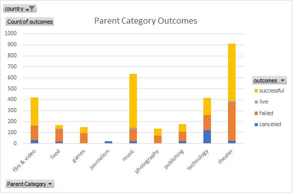
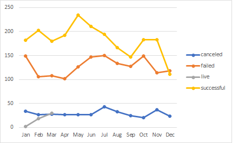

# An Analysis of Kickstarter Campaigns
Louise is interested in starting a kickstarter campaign to fund a musical play in Great Britain. She estimates her play will cost $12K.
Based on my analysis of prior campaigns with a similar monetary goal, Louise is unlikely to reach her goal of $12k and would need to reduce her goal in order to have a successful campaign. Her best opportunity would be to run the campaign in May and if she decides to run a campaign for the Great Britain market, she should reduce her goal closer to £2,000. The good news is, Theaters had the highest success rate of hitting their goals out of all categories. Reference the chart below
# 
# Statistical findings for theater plays in the US are as follow 
* The Mean of successful goals were $5,049, whereas failed were $10,554
* The Median of successful goals were $3,000, whereas failed were $5,000
* The upper quartile (75%) of successful pledged campaigns were $5,669, whereas failed were $501
* The lower quartile (25%) of successful pledged campaigns were $1,717, whereas failed were $9
* Source of information can be found here [data-1-1-3-StarterBook.xlsb](data-1-1-3-StarterBook.xlsb) on the sheet named "Descriptive Statistics Play"
# Statistical findings in Great Britain for theater plays are as follow
* The mean goal was $4,059
* Upper quartile (75%) goal was $5,625
* Lower quartile (25%) goal was $0
* Mean goal was $2,000
The findings suggest that the data is skewed to the right due to the mean being higher than the median and the lower quartile being zero. However, since the mean is £4,059, but the median goal was £2,000 with the mean pledged at roughly £1,500 Louise would want to reduce her goal substantially for a higher success rate.
* Source of information can be found here [data-1-1-3-StarterBook.xlsb](data-1-1-3-StarterBook.xlsb) on the sheet named "Box and Whisker Plot"
# Outcomes Based on Launch Date
After analyzing the data for most successful times to launch a campaign, I found that the best time to launch a kickstarter for theater plays in all countries is May and June. The least successful time to launch a campaign is in December.
# 
# Conclusion
* After close analysis of the data, the number one reason why kickstarter campaigns have failed in the Theater category is due to unreasonably high goals and poor timing of launching a campaign. For Louise to have the best luck in launching a kickstarter campaign, I would suggest reducing her costs closer to the $5,000 for the US market and £2,000 for the Great Britian market. For the best results, I would recommend to run her campaign in the month of May and consider listing it as the subcategory "plays".
