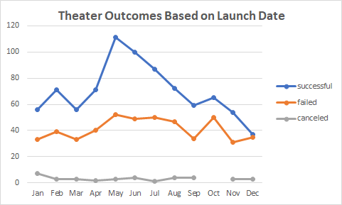
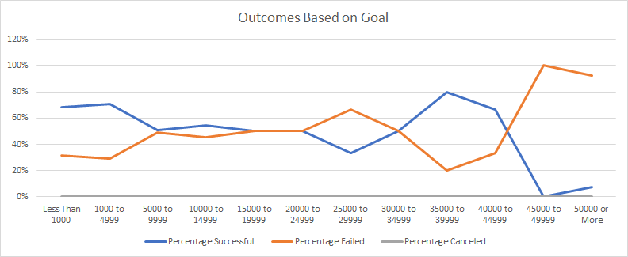
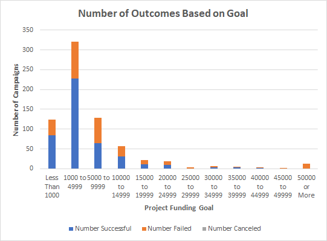

# Kickstarter Campaign Analysis of Outcomes 
## Project Overview
The purpose of this kickstarter campaign analysis was to look at the relationship between campaign outcomes, launch date, and fund goals to determine the best probability
of a successful campaign. Here is a link to the kickstarter data set including the spreadsheets of the data discussed in this analysis. [Kickstarter_Challenge.xlsx](Kickstarter_Challenge.xlsx)
---
## Analysis and Challenges
### Theater Outcomes by Launch Date
* When looking at the kickstarter data and trying to determine the best outcome of a campaign, I first wanted to know what time during the year was most successful for
running a campaign. Below you can see that by using the Unix Timestamp Converter and by using the years formula in excel, I was able to create a pivot chart based on
monthly outcomes of campaigns. These campaigns are broken into Successful, Failed, and Canceled for the "Theater" parent category.
# 
* After analyzing the data, the results from the chart above clearly show May as the best time to launch a new kickstarter campaign with the highest success rate (~67%) in the parent category, "Theater" and the worst time of year to run a campaign would be in December.
### Outcomes Based on Goals
* The second analysis was to determine what the relationship is between a campaigns outcome and their respected funding goal. By filtering the data and using the COUNTIFS formula, I was able to sort the information into a spreadsheet showing the number of successful, failed, and canceled projects based on their funding goals. This information is crucial in knowing the success of a campaign. From these numbers, I was also able to calculate the percentage of the outcomes. However, there are some interesting findings with this data review. Referencing the graph below, we can see that success rate is extremely high when the funding goal is low or easy to acheive. Anything below $5,000 has a relatively high successrate of 69%-71%. The data is slightly skewed left with majority of the data/campaigns goals being less than $20,000. Although, there are a few campaigns that were successful in the $35,000-$45,000 range with a high success rate, these would be specific outliers. The tricky part was trying to generate numbers for the number of canceled plays. I went back through the kickstarter data and filtered it by plays and outcomes to double check that there was in fact, zero plays campaigns canceled.
# 
* A secondary graph is provided below to show another visual of the data. This provides  a clearer picture of how the data is slightly skewed to the left where a higher number of data points are for kickstarter campaigns and their respective outcomes and the far right showing the very few outliers that had success rates with a much higher goal. Further data and information would need to be provided in order to understand why those projects hit their goals of $35,000-$50,000+.
# 
## Results
Based on the results of the data and further analysis, my findings point to May being the best time to run a campaign and December having the lowest success rate. 
A goal of $15,000 or less would yeild the best results. However, the lower the goal, the better the sucecss rate. The largest set of data is in the $1,000 to $5,000 range
which has yielded the highest success. The line graph suggests keeping your goal under $5,000 gives the biggests advantages. For further analysis, I would suggest diving 
deeper into why some of the outliers were successful at higher goals, specifically the $35,000-$40,000 range.
